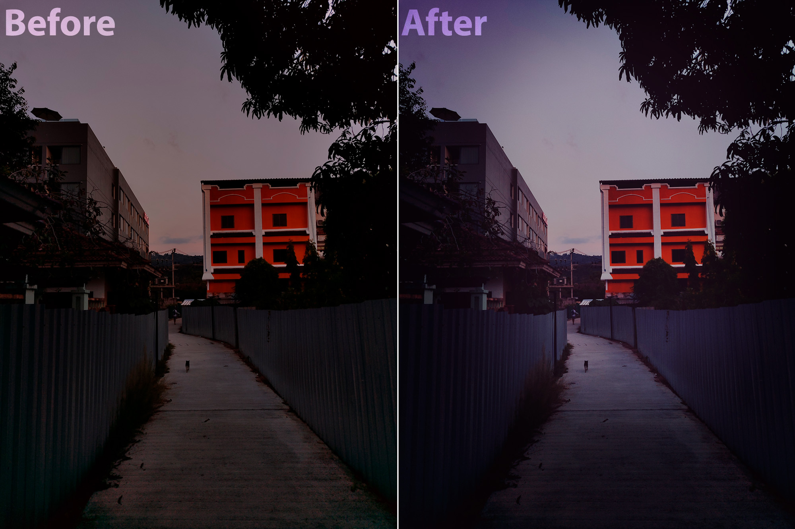

# RiseEffect
Applying Xiaomi camera HLSL shader to video.

### About
This tool is capable of applying the HLSL fragment shader to mp4 videos or picture. Processing takes place using FFMPEG frame-by-frame.

### Usage
1. You can build a project using Visual Studio or by downloading a binary file [from here](./binary.zip).
2. Edit config file **RiseEffect.dll.config**. It requires FFMPEG binary folder in **ffmpegBinPath** parameter.
3. Run **RiseEffect.exe** for processing **input.mp4** video as follows -\
`.\RiseEffect.exe input.mp4`\
Output file will be in **input_rise.mp4**, audio will be copied from input file.

### Samples
Processed video sample will be found [here](https://drive.google.com/file/d/10ZvozslR73rlZXNYNRbO1fkgQJCxx_0B/view?usp=sharing).\

### Shader
By default tool uses Xiaomi Mi A1 'Lomo' filter. If you want to change shader, replace it by yours in **RiseEffect\Shader\Filters** folder.
